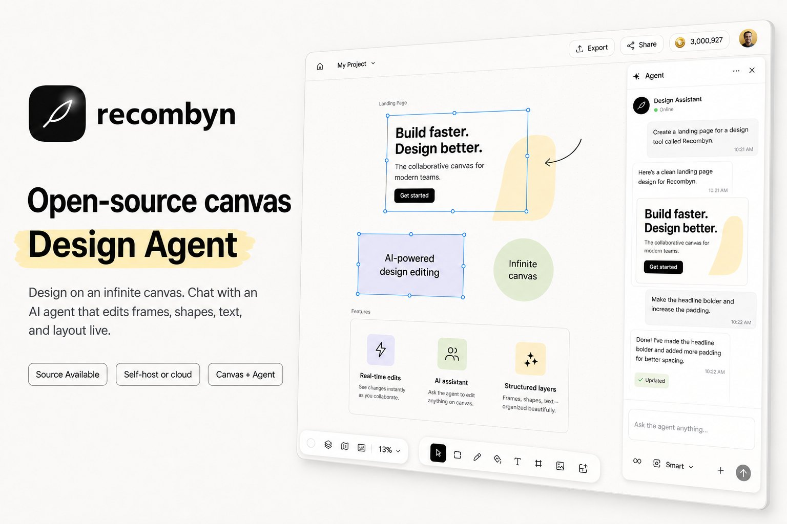

<p align="center">
  
</p>

<p align="center">
  <a href="docs/self-hosting.md"><strong>Self Host</strong></a> ·
  <a href="https://recombyn.com"><strong>Cloud</strong></a> ·
  <a href="https://recombyn.github.io/recombyn/"><strong>Docs</strong></a>
</p>

<p align="center">
  <a href="LICENSE"></a>
  <a href="docs/self-hosting.md"></a>
  <a href="apps/web"></a>
  <a href="apps/api"></a>
  <a href="SECURITY.md"></a>
</p>

<p align="center">
  <a href="README.md"></a>
  &nbsp;
  <a href="README.zh-CN.md"></a>
  &nbsp;
  <a href="README.ja.md"></a>
</p>

**Recombyn** は **キャンバスエディタ + AI Design Agent**（ソースアベイラブル）です。  
無限キャンバス上でデザインし、LangGraph エージェントが会話を通じてレイヤー・図形・テキスト・レイアウトを編集します。

Docker Compose で数分でセルフホストできます（既定は **MySQL** + Redis + Web + API + **Yjs コラボ**）。ローカル開発では空の `DATABASE_URL` で **SQLite**、または **PostgreSQL** — [docs/postgres-switch.md](docs/postgres-switch.md) を参照。

---

## なぜ Recombyn？

- **本格キャンバス編集** — フレーム、図形、画像、動画、テキスト。エクスポートと共有
- **リアルタイム共同編集** — 同一プロジェクトを Yjs 同期（カーソル、選択、Undo）。閲覧のみ / 編集を共有可能
- **描画する Agent** — 会話で計画し、キャンバス操作を適用
- **セルフホスト優先** — ローカルもサーバーも同じスタック
- **組み合わせ可能** — インフラ seed + プロンプトパック + `apps/api/data/` の **コア Agent skills**

## 主な機能

- **ビジュアルエディタ** — 選択、レイヤー、塗り、エクスポート、共有
- **リアルタイムコラボ** — Yjs WebSocket（`apps/collab`）；エディタの Live バー；nginx `/collab/` 経由の WSS
- **Design Agent** — LangGraph ツール / skills；作成・編集・ストリーミング UI
- **画像インポート** — ローカル画像 → 編集可能なキャンバスノード
- **Plaza & プロジェクト** — インスピレーションフィードと保存作品（API）

## クイックスタート（セルフホスト）

```bash
git clone https://github.com/recombyn/recombyn.git
cd recombyn
cp apps/api/.env.example apps/api/.env   # LLM_API_KEY / プロバイダキーを設定
docker compose up -d --build
```

| サービス | URL |
|---------|-----|
| Web | http://localhost:3000 |
| API docs | http://localhost:8000/docs |
| MySQL | `127.0.0.1:3306` · `recombyn` / `recombyn` |

詳細（env、LLM、本番 hardening）: **[docs/self-hosting.md](docs/self-hosting.md)** · Postgres: **[docs/postgres-switch.md](docs/postgres-switch.md)**

### ローカル開発

```bash
docker compose up -d redis   # または: mysql redis
npm install
cp apps/api/.env.example apps/api/.env
npm run dev:api              # 空 DATABASE_URL → SQLite
npm run dev:collab           # Yjs WS :1234（任意）
npm run dev:web
```

Canvas Live / WSS: **[docs/self-hosting.md § Canvas multiplayer](docs/self-hosting.md#canvas-multiplayer-yjs--wss)** · [apps/collab/README.md](apps/collab/README.md)

### デスクトップ（Tauri）

**[docs/desktop.md](docs/desktop.md)** を参照。**Rust** と OS ビルドツールが必要です。

```bash
# ローカル — API sidecar + SQLite 同梱
npm run dev:desktop
npm run build:desktop:sidecar
npm run build:desktop

# クラウド — https://recombyn.com（VITE_API_BASE_URL で上書き可）
npm run dev:desktop:cloud
npm run build:desktop:cloud
```

成果物: `apps/web/src-tauri/target/release/bundle/`（インストーラ）；本体 `…/target/release/recombyn.exe`。

## リポジトリ構成

```
apps/web/          React キャンバス + Agent UI + Yjs クライアント
  src-tauri/       Tauri v2 デスクトップシェル（Recombyn）
apps/api/          FastAPI — Scene, Agent, plaza, wallet, collab tokens
apps/collab/       Yjs WebSocket サーバー（y-websocket）
apps/docs/         ヘルプ / 法務サイト
packages/          共有ビルダー & スキーマ
docs/              アーキテクチャ + セルフホスト + デスクトップ
deploy/            Dockerfile / Nginx
e2e/               Playwright
```

## ドキュメント / コミュニティ

- [セルフホスト](docs/self-hosting.md) · [デスクトップ (Tauri)](docs/desktop.md) · [PostgreSQL 切り替え](docs/postgres-switch.md) · [コントリビュート](CONTRIBUTING.md) · [セキュリティ](SECURITY.md) · [行動規範](CODE_OF_CONDUCT.md)
- Issue / PR テンプレートは `.github/`

## ライセンス

[Recombyn Source Available License v1.0](./LICENSE) © Recombyn contributors · [NOTICE](./NOTICE)

ソースアベイラブル条件（OSI オープンソースではありません）:

- **個人 / プライベートセルフホスト** — 無料
- **単一組織内利用** — 可
- **第三者向けのホスト / マネージド提供**（有償・無償問わず）— **商用許諾が必要**（`702680355@qq.com`）

全文は [LICENSE](./LICENSE) を参照。

## GitHub で ⭐ Star を

オープンソースは時間がかかります。Recombyn が役に立ったら、右上の **⭐ Star** をお願いします。

→ [https://github.com/recombyn/recombyn](https://github.com/recombyn/recombyn)
