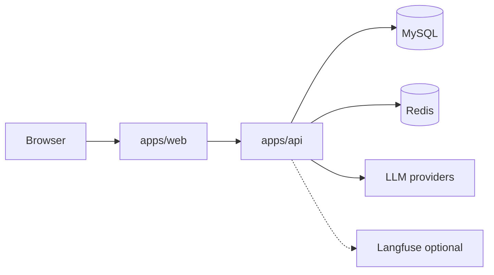

<p align="center">
  
</p>

<p align="center">
  <a href="docs/self-hosting.md"><strong>Self Host</strong></a> ·
  <a href="https://recombyn.com"><strong>Cloud</strong></a> ·
  <a href="apps/docs"><strong>Docs</strong></a>
</p>

<p align="center">
  <a href="#readme">English</a> ·
  <a href="README.zh-CN.md">简体中文</a>
</p>

<p align="center">
  <a href="LICENSE"></a>
  <a href="docs/self-hosting.md"></a>
  <a href="apps/web"></a>
  <a href="apps/api"></a>
  <a href="SECURITY.md"></a>
</p>

**Recombyn** is an open-source **canvas editor + AI Design Agent**.  
Create and edit visual designs on an infinite canvas, talk to an agent that can plan and apply canvas operations, and run everything on your own machine.

Self-host in minutes with Docker Compose (MySQL + Redis + web + API). Optional [Langfuse](https://langfuse.com) for Agent tracing. Proudly built as a MIT-licensed monorepo.

---

## Why Recombyn?

| | |
|---|---|
| **Visual editor** | Frames, shapes, images, text — not just chat that dumps a single image. |
| **Agent that paints** | LangGraph design agent with tools, skills, and ask/confirm flows. |
| **Self-host first** | Same stack for local and server; your data stays yours. |
| **Composable** | Seed JSON for skills / flows / dicts — no private Admin console required to boot. |

## Core features

- **Visual editor** — selection, layers, fills, export, share
- **Design Agent** — create / edit / chat with streaming UI
- **Import pipeline** — PDF / DOCX / image → Scene JSON
- **Plaza & projects** — inspiration feed and saved work (API)
- **Observability** — optional local Langfuse traces (`metadata.task_id`)

## Quick start (self-host)

```bash
git clone <this-repo-url>
cd recombyn   # or your local folder name
cp apps/api/.env.example apps/api/.env   # add LLM_API_KEY / provider keys
docker compose up -d --build
```

| Service | URL |
|---------|-----|
| Web | http://localhost:3000 |
| API docs | http://localhost:8000/docs |
| MySQL | `127.0.0.1:3306` · `recombyn` / `recombyn` |

> Change default DB and bootstrap admin passwords before any public deploy.  
> Full guide: **[docs/self-hosting.md](docs/self-hosting.md)**

### Local development

```bash
docker compose up -d redis   # or: mysql redis
npm install
cp apps/api/.env.example apps/api/.env
npm run dev:api              # empty DATABASE_URL → SQLite
npm run dev:web
```

## Architecture (high level)



## Repository layout

```
apps/web/          React canvas + Agent UI
apps/api/          FastAPI — Scene, Agent, plaza, wallet
apps/docs/         Help / legal site
packages/          Shared builders & schemas
docs/              Architecture + self-hosting
deploy/            Dockerfiles / Nginx
infra/langfuse/    Optional observability stack
e2e/               Playwright
```

Operator Admin is an **internal private console** (separate repo, **not published**). OSS self-host uses `apps/api/data/*.json` seeds only.

## Documentation

| Doc | Link |
|-----|------|
| Self-hosting | [docs/self-hosting.md](docs/self-hosting.md) |
| Contributing | [CONTRIBUTING.md](CONTRIBUTING.md) |
| Security | [SECURITY.md](SECURITY.md) |
| Code of Conduct | [CODE_OF_CONDUCT.md](CODE_OF_CONDUCT.md) |
| Architecture | [docs/architecture.md](docs/architecture.md) |
| Maintainer OSS checklist | [docs/open-source-checklist.md](docs/open-source-checklist.md) |

## Community

- **Issues** — bug & feature templates under `.github/ISSUE_TEMPLATE/`
- **PRs** — see [CONTRIBUTING.md](CONTRIBUTING.md)
- **Security** — report privately per [SECURITY.md](SECURITY.md)

## License & model

[MIT](./LICENSE) © Recombyn contributors · [NOTICE](./NOTICE)

Individuals can self-host for free. We plan to offer **hosted Cloud** and enterprise support later — the MIT core stays open (same shape as many OSS + Cloud products).

---

<p align="center">
  
</p>
