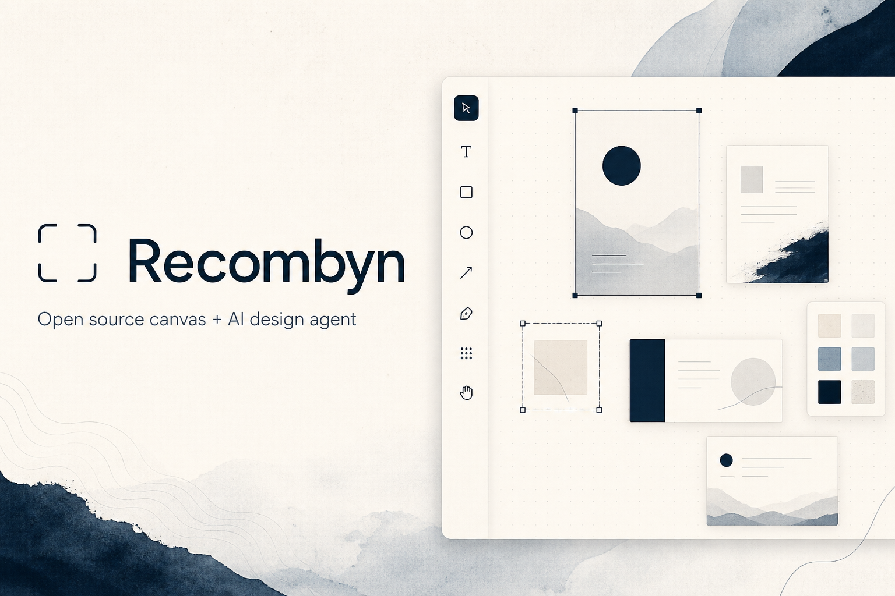

<p align="center">
  
</p>

<p align="center">
  <a href="docs/self-hosting.md"><strong>自托管</strong></a> ·
  <a href="https://recombyn.com"><strong>Cloud</strong></a> ·
  <a href="apps/docs"><strong>文档</strong></a>
</p>

<p align="center">
  <a href="README.md">English</a> ·
  <a href="#readme">简体中文</a>
</p>

<p align="center">
  <a href="LICENSE"></a>
  <a href="docs/self-hosting.md"></a>
  <a href="apps/web"></a>
  <a href="apps/api"></a>
</p>

**Recombyn** 是开源的 **画布编辑器 + AI Design Agent**。  
在无限画布上创作与编辑，用 Agent 规划并落笔改画布，整套可在自己的机器上跑。

几分钟内用 Docker Compose 自托管（MySQL + Redis + Web + API）。MIT 协议 monorepo。

---

## 为什么选 Recombyn？

| | |
|---|---|
| **可视化编辑** | 画板、形状、图片、文字 — 不只是对话吐一张图 |
| **会落笔的 Agent** | LangGraph 设计 Agent：工具、技能、确认流 |
| **自托管优先** | 本地与服务器同一套栈，数据在你这边 |
| **可组合** | 技能 / 流程 / 字典以 `apps/api/data/` 下种子 JSON 交付，可自行改 |

## 核心能力

- **可视化编辑** — 选区、图层、填充、导出、分享  
- **Design Agent** — 创建 / 编辑 / 闲聊，流式对话 UI  
- **导入管线** — PDF / DOCX / 图片 → Scene JSON  
- **广场与项目** — 灵感流与作品（API）

## 快速开始（自托管）

```bash
git clone https://github.com/recombyn/recombine.git
cd recombine
cp apps/api/.env.example apps/api/.env   # 填入 LLM_API_KEY 等
docker compose up -d --build
```

| 服务 | 地址 |
|------|------|
| Web | http://localhost:3000 |
| API 文档 | http://localhost:8000/docs |
| MySQL | `127.0.0.1:3306` · `recombyn` / `recombyn` |

更多选项（环境变量、模型密钥、生产加固）：**[docs/self-hosting.md](docs/self-hosting.md)**

### 本地开发

```bash
docker compose up -d redis
npm install
cp apps/api/.env.example apps/api/.env
npm run dev:api
npm run dev:web
```

## 仓库结构

```
apps/web/          React 画布 + Agent UI
apps/api/          FastAPI
apps/docs/         帮助 / 法律站
packages/          共享协议
docs/              架构与自托管
deploy/            Dockerfile / Nginx
e2e/               Playwright
```

## 文档与社区

- [自托管](docs/self-hosting.md) · [贡献指南](CONTRIBUTING.md) · [安全](SECURITY.md) · [行为准则](CODE_OF_CONDUCT.md)
- Issue / PR 模板见 `.github/`

## 协议

[MIT](./LICENSE) © Recombyn contributors · [NOTICE](./NOTICE)

个人可免费自托管；后续计划提供 **Cloud 托管与企业服务**，核心保持 MIT 开源。

---

<p align="center">
  
</p>
