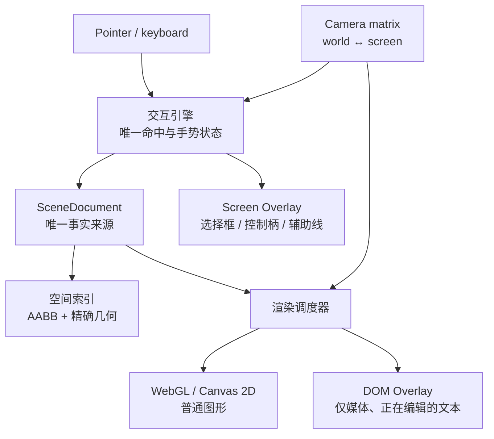

# 画布执行前计划：目标架构已定 + 本轮只钉换算

- **状态：** 换算本轮已落地；后续压测与改动服从 [ADR 0027 附录 A](./adr/0027-appendix-unified-hit-camera-stress.md)（统一命中 / CameraTransform / 禁止单点补丁）
- **日期：** 2026-08-16
- **架构权威：** [ADR 0027](./adr/0027-canvas-layered-runtime.md) + [附录 A](./adr/0027-appendix-unified-hit-camera-stress.md)
- **Checklist：** [canvas-unified-pipeline-checklist.md](./canvas-unified-pipeline-checklist.md)
- **本轮范围：** 在该架构下，只修 **CameraTransform 换算与吸附格子一致性**（网格 / 钢笔落点 / 内容外缘 / 控制框）。不推倒重写，不另起架构，不借机迁 WebGL。

---

## 0. 先把话说死

| 命题 | 结论 |
|------|------|
| 目标架构是什么？ | **SceneDocument + CameraTransform + 分层渲染 + 独立命中**（见 §1） |
| SVG 还是不是运行时事实层？ | **不是。** SVG = 导出 / 兼容 / 少量低频 UI。事实层是 Scene + Camera + SpatialIndex |
| 本轮改什么？ | **换算公式与吸附目标对齐**（§3–§6），让现有分层在 5%–10000% 下误差 ≤ 1 screen px |
| 本轮不改什么？ | 不迁渲染内核、不新加图层职责、不重写 Selection 组件体系、不新增 orphan helper 文件 |
| 「不要改架构」指什么？ | 不要在 ADR 0027 之外另搞一套；也不要本轮把阶段二/三/四提前做完。**架构已定，落地分阶段；本轮 = 阶段一的换算钉死** |

---

## 1. 目标架构（已确认）

不要让 SVG/DOM 同时承担绘制、命中、控制框。已有正确基础：`SceneDocument`、相机数学、`SceneSpatialRuntime`。要拆开的是耦合。



### 1.1 四条事实

1. **`SceneDocument`** — 唯一文档事实（Redux / collab 写入这里）。
2. **`CameraTransform`** — 唯一一份矩阵；热路径只用 `worldToScreen` / `screenToWorld` / `screenDeltaToWorldDelta`；**禁止**高频路径用 `getBoundingClientRect` / 镜像 `viewBox`「校正」坐标。
3. **分层渲染** — 普通墨水 → Canvas2D → 再 WebGL；媒体 / 正在编辑文本 → 稀疏 DOM；选择框 / 辅助线 / 框选 → **屏幕空间 Overlay**（不跟 world CSS `scale`）。
4. **独立命中** — 根画布 Pointer Capture → chrome 命中 → 空间索引粗筛 → 精确几何。`sceneToSvg` = 导出 / 兼容，不是实时核心。

### 1.2 相机只留一份

```ts
type Camera = {
  x: number;
  y: number;
  zoom: number;
  // rotation?: number; // 未来画布旋转再开
};
```

实现落点：`rcbCameraScreenOffset` + `rcbCameraCssZoom` + `createCameraTransform` / `worldToScreen` / `screenToWorld`。  
渲染、选择、吸附、导出 **同一套纯函数**。

### 1.3 谁画什么（目标）

| 内容 | 推荐 |
|------|------|
| 矩形、路径、连线、普通图、背景、网格 | Canvas2D → 最终 WebGL |
| 过渡期矢量 | Canvas2D + 视口裁剪 |
| 视频 / 音频 / Lottie / 富文本编辑态 | 少量 DOM Overlay |
| 非编辑态文字 | GPU / Canvas |
| 选择框、控制柄、吸附线、框选 | **屏幕空间 Overlay**（恒定 screen px） |
| 导出 SVG/PDF | 从 `SceneDocument` 独立生成，不复用屏幕 DOM |

### 1.4 控制框

- 屏幕空间；每帧 `world → screen`；柄 8–12 screen px，**不靠 world 上 `1/zoom` 补丁当权威**。
- 不复制 SVG `viewBox`；不参与内容重绘；选中 N 个节点画 **一个** union 框。
- 命中：代码判定，不靠多层 SVG `pointer-events`。

### 1.5 事件一个入口

- 根：`pointerdown / move / up` + Pointer Capture。
- `move`：内存预览 + RAF；不 Redux 全量 scene。
- `up`：一次写入 SceneDocument / 历史 / 协作。
- DOM 只留正在编辑文本、正在播的媒体等。

### 1.6 空间索引

`SceneSpatialRuntime` = 唯一粗筛；流程：粗筛 → z 倒序 → 精确几何（数学 / Path2D / AABB）。默认不再依赖 SVG DOM 命中。

---

## 2. 分阶段落地（不推倒重写）

| 阶段 | 目标 | 状态 |
|------|------|------|
| **一** | 钉死坐标与交互：单一 CameraTransform；chrome / 吸附 / 网格 / 落点同一格子；根 pointer；RAF 预览松手提交；5%/100%/800%/10000% 回归 | **本轮做换算钉死**；其余已部分落地，见 ADR |
| **二** | `SceneRenderer` 抽象；`SvgRenderer` 适配旧路径；`CanvasRenderer` 共场景 / 相机 / 命中协议 | 进行中（已有 canvas2d underlay） |
| **三** | 迁高频节点：网格·辅助线·选择框 → 基础形·图 → 路径·笔 → 非编辑文字；视频/Lottie 保持 DOM | 进行中 |
| **四** | Canvas2D → WebGL（atlas、脏区、批处理、可选 Worker） | 未开始 |

**验收总标（架构级）：**

- 1 万轻量节点平移稳 60 FPS
- pointermove → 反馈 P95 &lt; 16ms；单点命中 P95 &lt; 1ms
- 非媒体 DOM 数百以内
- 缩放 5%–10000%：内容 / 命中 / 控制框误差 ≤ 1 screen px
- 拖动不触发 Redux 全量 scene
- 导出与屏幕共用 SceneDocument，不依赖 DOM 墨水

---

## 3. 本轮用户可见问题（阶段一 · 换算）

1. 钢笔蓝色 `+` 不在网格交点（漂在格内）。
2. 矩形等外缘不贴网格（网格像假的）。
3. 控制框 / 白角点 / 旋转 L 相对内容乱；DevTools 绿框是旋转 L 的 AABB，不是第二套坐标。
4. 多选 union 须罩住全部成员（union AABB，不是首成员）。

**根因口径：** 在已定分层下，`scene ↔ screen`、`visual ↔ geom`、`snap 目标` 未锁成同一 `gℤ` 格子；**不是**缺一层、**不是**本轮改渲染宿主。

---

## 4. 本轮禁止

| 禁止 | 原因 |
|------|------|
| 另起与 ADR 0027 冲突的架构 | 架构已定 |
| 本轮把钢笔 tip / 选择框整层迁到新表面「为了对齐」 | 用换算对齐；迁层属阶段二/三，单独立项 |
| 新增 `*Utils.ts` / orphan helper | 仓库规则 |
| 重写 `SelectionFeature` / 大拆文件 | 超 scope |
| 提前上 WebGL / 批渲染 | 阶段四 |
| 为好看重做旋转 L 产品模型 | 最多修 L 的 zoom / 外推换算 |

---

## 5. 本轮必须钉死的换算

### 5.1 相机（唯一）

```
pan = rcbCameraScreenOffset(camera, dpr)
z   = rcbCameraCssZoom(camera)
screen = scene * z + pan
scene  = (stageLocal - pan) / z
```

禁止混用未 snap 的 `camera.x/y`、未 `toDomPrecision` 的 zoom、热路径 DOM 回读。

### 5.2 网格

- 轴：`x,y ∈ gℤ`（与 `snapCoordToGrid` 同格）
- 禁止对轴线再 `snapSceneStrokeAxis` 把线挪离吸附格

### 5.3 钢笔

- 指针：`rcbScreenToScene`
- 吸附：**仅网格交点** `gℤ × gℤ`（不要边中点，除非产品另批）
- tip / rubber / click **同一 place 点**；仍用现有 preview 表面，只改坐标

### 5.4 形状绘制 / 移动

| 步骤 | 空间 | 规则 |
|------|------|------|
| 拖预览外框 | visual outer | `snapBoxEdgesToGrid` |
| 写入 | geom | visual 按 strokeAlign inset |
| 移动 | visual outer | `snapBoxToGrid(visual)` → delta 回 geom |
| 禁止 | — | 对 w/h 单独再 snap |

### 5.5 控制框

- body：`worldToScreen(box.left/top)` + `scale(z)`（禁止 host SVG translate 当权威）
- 单选：live geom + `chromeOutset`；多选：**union AABB**
- 旋转 L 外推：同一 `rcbCameraCssZoom`，带 screen cap

---

## 6. 关联缺陷清单（≥20，本轮优先标「本轮」）

1. **本轮** 钢笔 tip 与网格轴不同格  
2. **本轮** 边中点吸附 vs 交点产品口径  
3. **本轮** tip/rubber 跟 raw，未与 place 共用  
4. **本轮** `camera.zoom` vs `rcbCameraCssZoom` 混用  
5. **本轮** 绘制后二次 snap w/h 拉离格  
6. **本轮** create 0.5 量化与 visual 外缘不一致  
7. **本轮** 移动 snap geom 而非 visual outer  
8. **本轮** chrome body 跟 host CSS → 双格子  
9. **本轮** 多选用首成员 box  
10. chromeOutset vs strokeAlign 不一致  
11. 旋转 L zoom/cap 错误 → 高倍飞出  
12. 白角点 vs 旋转 L 局部坐标，审查像「审不到」  
13. hit-pad 与墨水双坐标残留  
14. 某工具链未走 `rcbClientToStageLocal` scale  
15. `preventDefault` 吃掉 dblclick（可顺带）  
16. guide `at` 用 geom 边  
17. Frame vs shape snap 分叉  
18. Generator place 离格  
19. Arrow nudge 基准边是 geom  
20. `toDomPrecision` 与未量化混加  
21. grid view snap pan vs 旧路径 raw pan  
22. pen commit pad 后外缘离格  
23. resize 锁比例后边离 `gℤ`  
24. 旋转后仍轴对齐 grid（记债）  
25. fractional DPR surface origin 与 tip 不同步  
26. overlay vs world 同点 >1px  
27. toolbar W/H geom/visual 观感不一致  
28. idle Canvas box vs SVG host 换算  
29. 测试仍断言边中点合法  
30. 半笔宽 visual 约定未写死（见 §5.4）

---

## 7. 本轮白名单文件

- `PenDrawFeature.tsx` / `PenPathEditFeature.tsx` — 吸附口径、place 同点  
- `ShapeDrawFeature.tsx` — visual 边吸附  
- `alignGuides.ts` / `selectionLogic.ts` — visual 语义  
- `HostPathChrome.tsx` / `SelectionChrome.tsx` — **仅** CTM / union / zoom 换算  
- `core/math.ts` — 仅当 screen↔scene 分叉  
- `sceneRenderer.ts` — **仅**确认 grid ∈ `gℤ`，不改渲染职责  
- 对应 `__tests__`

---

## 8. 本轮执行顺序

1. 断言 `rcbSceneToScreen ∘ rcbScreenToScene ≈ id`  
2. 钢笔：只交点；tip/rubber/click 同点  
3. 绘制：visual 四边 → geom；提交后 inflate 外缘 ∈ `gℤ`  
4. 移动：visual `snapBoxToGrid` → delta  
5. 控制框：CameraTransform + union AABB  
6. 跑相关 vitest + 人工 ≥800% 对拍  

---

## 9. 本轮完成定义

- 架构表述与 ADR 0027 / §1 一致；本轮 diff **不改变分层职责**。  
- 网格、钢笔落点、形状外缘、控制框原点，在 §5 公式下对齐（≤ 1 screen px）。  
- 「本轮」清单有测或对拍；其余留债。  
- 无新 helper 文件、无 WebGL、无整层迁移。

---

## 10. 评审结论（勾选后再写代码）

- [x] 同意目标架构 = **SceneDocument + CameraTransform + 分层渲染 + 独立命中**（§1）
- [x] 同意本轮 = **阶段一 · 只钉换算**，不提前做阶段二/三/四的迁层
- [x] 同意钢笔吸附 = **仅网格交点**
- [x] 同意白名单与 §8 顺序

**执行状态：** 进行中（钢笔交点吸附 + zoom 统一 + 绘制 minSide 保格）

---

## 11. 浏览器压测报告（2026-08-16）

分多轮跑 Playwright 活编辑器 + 相关 vitest；发现问题再改，不打盲补丁。下面按轮次记录。

### 第 1 轮 — 换算 / 格子 / 命中基线

| 功能 | 用例 | 结果 |
|------|------|------|
| 控制框 ↔ 墨水 / visual 外缘贴格 | `canvas.chromeAlign.spec.ts` | 通过 |
| Frame 白底 ↔ chrome | `canvas.frameChromeAlign.spec.ts` | 通过（偶发 flaky，retry 过） |
| 钢笔 tip / rubber 仅网格交点 | `canvas.penGrid.spec.ts` | 见第 3 轮修复后通过 |
| 点击选中 + 框选 | `canvas.hitSelect.spec.ts` | 先挂后修，见下 |
| 画布基础 | `canvas.foundations.spec.ts` | 通过 |
| 换算纯函数 | vitest `mathScreenScene` / sceneRenderer 等 | 通过 |

**本轮发现并修改：**

1. **点击选中失效** — `createSvgSceneRenderer.hitTest` 在 `disposed` 后直接 `null`，而 SvgCanvas 仍可能短暂挂着该实例 → bridge 命中空。  
   - 改：`hitTest` 在 dispose 后仍走 `hitTestWithSpatialIndex`（canvas2d 适配器同样）。  
   - 单测改为断言 dispose 后仍可命中。

2. **Idle Canvas 卸 host（历史）** — 预算内把节点只画在 Canvas → 无 `[data-scene-node-id]` → 命中/chrome 全挂。  
   - 改：预算内保留 SVG host（此前已合入）。

3. **Zoom 格子分叉（历史）** — `rcbZoomAtPoint` 用 raw camera，chrome/grid 用 display lattice。  
   - 改：zoom 枢轴统一 `rcbCameraScreenOffset` + `rcbCameraCssZoom`。

### 第 2 轮 — 轮廓 / path-edit / 长批次稳定性

| 功能 | 用例 | 结果 |
|------|------|------|
| 轮廓化 → path-edit pad↔knob | `canvas.outlineHit`（rect） | flaky：偶发未进 path-edit（`padCount=0`）；retry 时常过；pad↔knob ≤1px |
| 文字轮廓 CJK | `canvas.outlineHit`（text） | 超时 / browser closed（重负载，留债） |
| 钢笔高倍 | `canvas.penGrid`（长套件尾） | 受前序崩溃/遮罩影响会挂；单独跑可过 |

**本轮改动（测试硬化，非产品迁层）：**

- path-edit 进入条件改为：preview +（pads 或 knobs）。  
- 高倍缩放锚在墨水中心，避免 pad 飞出视口。  
- 缩放后若 pad 出屏，尝试 wheel pan 拉回（仍可能 skip drag）。

### 第 3 轮 — 钢笔 tip 死活（压测中最硬的 bug）

**现象：** 工具已是 pen（光标对），但 `[data-pen-snap-tip]` 永不出现；`__rcbPenDiag` 显示 hitEl 已挂上 canvas。

**根因（对拍）：**

1. `PenDrawFeature` / `PenPathEditFeature` 只用 `stageEl \|\| paperEl`，未跟 Shape/Pencil 一样走 `useRcbViewportEl` + `rcbResolveViewportEl`。  
2. `pointermove` 仅冒泡监听；上层 pe:auto 层（tour / frame 等）可挡住，stage 收不到 move → tip/rubber 不更新。

**修改：**

- 钢笔 / path-edit：`rcbResolveViewportEl(viewportEl, stageEl, paperEl)`。  
- 钢笔：`pointermove` / `pointerup` 在 **stage capture + window capture** 双挂。  
- e2e：`penGrid` 加强关掉 onboarding `role=dialog aria-modal`。

**回归抽检（retry=1）：** `penGrid` + `chromeAlign` 通过；`hitSelect` 1 次 flaky 后通过。

### 本轮代码改动清单（相对压测前）

| 区域 | 文件 | 改什么 |
|------|------|--------|
| 命中 | `sceneRenderer.ts` | dispose 后仍可 spatial hit |
| 钢笔 | `PenDrawFeature.tsx` | viewport 解析 + window/stage capture move |
| path-edit | `PenPathEditFeature.tsx` | 同上 viewport 解析 |
| 单测 | `sceneRenderer.test.ts` | dispose 后仍命中 |
| e2e | `canvas.outlineHit.spec.ts` / `penGrid.spec.ts` | 进入条件 / 关 tour / 缩放锚点 |

### 仍未压完 / 留债

- `canvas.tools.stress` / `ops.stress` / `deep.stress`：本轮未整包跑完（时间与前序不稳定）。  
- 文字 Outline CJK e2e：超时易拖垮 browser。  
- outline path-edit 首次进入偶发空（需再钉 `resume:enter-path-edit` 时序）。  
- 计划 §6 非「本轮」项（旋转后贴格、半笔宽约定文档化等）未动。  
- hitSelect 仍带诊断日志，可后续收干净。

### 结论

换算主路径（chrome / frame / 钢笔交点 / 点击命中）在浏览器压测下可闭环；本轮真实修掉的是 **dispose 空命中** 与 **钢笔 pointer 进不了 tip**，不是再叠一层坐标补丁。下一轮建议只跑 tools/ops stress，并单开文字 Outline。

**规范升级（同日）：** 全部后续轮次按 [附录 A](./adr/0027-appendix-unified-hit-camera-stress.md) 四轮模板出报告；CR 卡点见 [checklist](./canvas-unified-pipeline-checklist.md)。已知未收敛债（path-edit HTML pads、Pen window capture）记在附录 A.4，下一轮优先下沉公共命中管线，禁止再扩分支。

---

## 12. 【第1轮浏览器压测报告】CameraTransform / 格子

1. **测试浏览器：** Chromium（Playwright）
2. **覆盖缩放区间：** 约 100%～≥800%～~2000%+（`chromeAlign` / `penGrid` / `frameChromeAlign` 高倍轮询；纯函数覆盖 fractional DPR）
3. **压测功能点：**
   - `world↔screen` / round-trip（vitest `mathScreenScene`）
   - 钢笔 tip/rubber ∈ `gℤ×gℤ`（`penGrid`）
   - 矩形 visual 外缘贴格 + chrome↔path（`chromeAlign`）
   - Frame plate ↔ chrome（`frameChromeAlign`）
   - 点击命中 + 框选（`hitSelect`）
   - foundations 网格 settle
4. **发现问题清单：**
   - 本轮批次 **无新失败**（5/5 e2e 通过；55 vitest 通过）
   - 审计：仍有附录 A.4 债 — path-edit `mountChromeHitPad`、Pen `window` capture move；shape handle overlays 仍见 `1/z` 作描边线宽（渲染粗细，非第二套坐标权威，Round 2 核对）
   - 热路径诊断 `__rcbHitTrace` / `__rcbBridgeWrap` 曾无条件写 window（噪音）
5. **修改的底层公共模块/函数：**
   - `sceneRenderer.ts`：`__rcbHitTrace` 仅 `import.meta.env.DEV`
   - `sceneHitBridge.ts`：`__rcbBridgeWrap` 仅 DEV（`__rcbBridgeHitTest` 保留供 e2e）
   - **未**在业务层打新坐标补丁
6. **受影响关联模块：** hit 诊断钩子；生产命中路径不变
7. **验证结果 & 遗留风险：**
   - ✅ Round 1 Camera/格子主路径通过
   - ⚠ Safari 未跑
   - ⚠ 5% / 10000% 极端人工对拍未在本轮全覆盖（e2e 偏高倍）
   - 遗留：A.4 → Round 2 下沉统一几何命中，去掉 Pen window 双挂
8. **补充回归用例：** 沿用现有 `canvas.chromeAlign` / `penGrid` / `frameChromeAlign` / `hitSelect`；Round 2 加控制点清单人工项

---

## 13. 【第2轮浏览器压测报告】全类型控制点命中（path-edit 优先下沉）

1. **测试浏览器：** Chromium（Playwright）
2. **覆盖缩放区间：** 高倍（outline / penGrid）；几何 registry vitest 用 zoom≈74
3. **压测功能点 / 控制点清单：**
   - ✅ 轮廓化 → path-edit 锚点 / 手柄（几何 AABB，无 HTML pad）
   - ✅ 钢笔 tip（公共 `attachViewportToolPointers`）
   - ✅ 点击选中 / 框选回归
   - ⏸ 选择框角/边、圆角、椭圆半径、多边形顶点：本轮未新开人工包（仍走现有 sel chrome 几何 + overlay seats）
   - ⏸ 网格吸附辅助控制点：未单测
4. **发现问题清单：**
   - path-edit 曾 **HTML pad + 几何 registry 双轨**（违反附录 A.1）
   - Pen / path-edit **各自私挂 window** pointer（碎片化）
5. **修改的底层公共模块/函数：**
   - `sceneHitBridge.ts`：新增 **`attachViewportToolPointers`**（stage capture + 单一共享 window fallback）
   - `PenPathEditFeature.tsx`：去掉 `mountChromeHitPad` / DOM `elementsFromPoint` 命中；仅 `setChromeKnobHits` + `pickChromeKnobHit`
   - `PenDrawFeature.tsx`：改用 `attachViewportToolPointers`（不再私挂 window）
   - `penPathEditHitPads.test.ts`：改为几何命中契约
   - `canvas.outlineHit.spec.ts`：断言 `padCount===0`、registry+painted knobs、拖拽走几何
6. **受影响关联模块：** path-edit、钢笔指针绑定、outline e2e；选择框 / radius overlay 未改
7. **验证结果 & 遗留风险：**
   - ✅ vitest path-edit / pen snap 通过
   - ✅ e2e：outline path-edit + penGrid + hitSelect 通过（retries 启用）
   - ⚠ window fallback 仍在公共 binder 内（非单点补丁，但尚未「唯一根指针」）
   - ⚠ radius/poly/star overlay DOM 命中仍在 `pickSelectionInkAtClient` 第 1 步 → Round 3 候选
   - ⚠ 文字 Outline CJK / Safari / 全控制点人工包未完
8. **补充回归用例：** `penPathEditHitPads`（几何）；outline e2e 标题改为 geometry knobs

---

## 14. 【第3轮浏览器压测报告】渲染 · 命中 · 网格一致

1. **测试浏览器：** Chromium（Playwright）
2. **覆盖缩放区间：** 高倍（outline / chromeAlign）；vitest 用 scene 几何坐标（无真实缩放 UI）
3. **压测功能点：**
   - 圆角 / 圆 / 多边形 / 星形 overlay knobs → **同一** `setChromeKnobHits` / `pickChromeKnobHit` 管线
   - `pickSelectionInkAtClient`：几何 registry 优先，DOM stack 仅 fallback
   - 路径编辑 knobs / 点击选中 / chrome 对齐回归
4. **发现问题清单：**
   - Round 2 遗留：radius/poly/star/circle seats 只登记 start 回调、**未写 sceneX/Y/half** → 命中仍靠 `elementsFromPoint` DOM
   - outline path-edit 首次进入偶发 `paintedCount===0`（retry 后通过；进入时序债）
   - 文字 Outline CJK e2e 仍失败（既有债，本轮未修）
5. **修改的底层公共模块/函数：**
   - `SelectionChrome.tsx`：`setOverlayHandleSeats` 镜像写入 knob registry；`pickSelectionInkAtClient` / `pickOverlayHandleAtClient` **优先几何**
   - `CornerRadiusHandlesOverlay` / `Circle` / `Polygon` / `Star`：发布 `sceneX/Y` + `half`（`chromeHandleHitRadiusScene`）
   - `SelectionFeature.tsx`：hover / dblclick 传入 scene 点
6. **受影响关联模块：** 选择 chrome overlays、overlay hover、path-edit 与 shape knobs 共享 registry
7. **验证结果 & 遗留风险：**
   - ✅ vitest：`chromePickDefersToRadius` / `selectionPointerHitOrder`（含无 DOM 几何命中）/ `penPathEditHitPads`
   - ✅ e2e 核心：`chromeAlign` + `hitSelect` 通过；`outlineHit` path-edit 几何 knobs **flaky→pass**
   - ⚠ `penGrid` 偶发 tip 超时（retry 后通过；与本轮 overlay 下沉无直接因果）
   - ❌ 文字 Outline CJK 仍红；Safari / 5%–10000% 全人工未跑
   - ⚠ DOM fallback 与 SVG `pointerEvents` 绘制仍在（权威已是几何；可后续再收 pe）
   - ⚠ `attachViewportToolPointers` window fallback 仍在 → Round 4 前可继续收口根指针
8. **补充回归用例：** `selectionPointerHitOrder` 增加「无 DOM stack、仅 registry」半径命中

---

## 15. 【第4轮浏览器压测报告】回归（防副作用）

1. **测试浏览器：** Chromium（Playwright）
2. **覆盖缩放区间：** 默认～高倍（chromeAlign / frameChromeAlign）；ops/deep 以 100% 为主
3. **压测功能点：**
   - 拖拽绘制 / 选中 / 框选（hitSelect）
   - 复制删除 / 撤销重做 / 剪贴板（ops）
   - 变换（resize dock + nudge）、多选 group / lock、导出 PNG（deep）
   - 钢笔 / 铅笔落笔、Frame / Text、图像生成器 composer
   - 格子 / chrome 对齐回归（chromeAlign / frameChromeAlign / foundations）
   - vitest：transform preview / hit order / move snap / resize / sceneRenderer / outline paint（109）
4. **发现问题清单：**
   - `[data-image-generator]` 已挂载且子控件可交互，但 Playwright `toBeVisible` 失败（`Received: hidden`）
   - 探针：`data-image-generator` GBR **height=0**（宽 500）；外层定位壳 `height:0` + flex 默认 **stretch** 把宿主压扁
5. **修改的底层公共模块/函数：**
   - `SelectionToolbarShell.tsx` → `WorldScreenChromeRoot`：`alignItems: 'flex-start'`，避免 height:0 壳层 stretch 塌缩 marker/host（生成器 / 选择 toolbar 共用）
   - **未**改 ImageGenerator 业务分支；**未**动 sceneToSvg 导出路径
6. **受影响关联模块：** 所有经 `WorldScreenChromeRoot` 的屏幕 chrome（选择条、图像/视频生成 composer 等）
7. **验证结果 & 遗留风险：**
   - ✅ vitest Round4 批：14 files / 109 tests
   - ✅ e2e：ops + deep + chromeAlign + hitSelect + frameChromeAlign + foundations → **12 passed**（含原失败的 image generator / generators 用例）
   - ⚠ 文字 Outline CJK e2e 仍未纳入本轮（附录债）
   - ⚠ Safari / 5%–10000% 全人工未跑
   - ⚠ `attachViewportToolPointers` window fallback 仍在（非本轮回归失败项）
8. **补充回归用例：** 无新文件；以 ops/deep 既有 image-generator 可见性断言锁定 `WorldScreenChromeRoot` 塌缩修复

---

## 16. 【债清扫】CJK Outline 卡死 + window 中继去重

1. **测试浏览器：** Chromium（Playwright）
2. **覆盖：** CJK 文字 Outline；钢笔 tip 格子
3. **压测 / 债项：**
   - 文字 Outline CJK e2e 曾卡满 4min（`fonts.ready` 无界 + fontkit 扫全 catalog + canvas scale12）
   - `attachViewportToolPointers` window 与 stage **双触发** onMove/onUp
4. **发现问题清单：**
   - `outlineFontCandidateUrls` 扫全 catalog → 串行加载多 MB CJK 面，主线程 `createFontkitFont` 冻结
   - `ensureTextFontsLoaded` `await document.fonts.ready` 可永久挂起
   - CJK canvas 轮廓 scale=12 过重，Outline 点击后拖垮 teardown
5. **修改的底层公共模块/函数：**
   - `outlineTextFont.ts`：CJK 跳过 fontkit（走 canvas）；候选 URL 封顶；加载间 `yieldMain`
   - `outlineToPath.ts`：`fonts.load` 2.5s 预算；CJK canvas scale 5 + 简化点数上限
   - `sceneHitBridge.ts`：`attachViewportToolPointers` window **仅转发 hitEl 外事件**（去重）
6. **验证：**
   - ✅ e2e CJK Outline：`rings:30` / pathLen≈7k（~43s 批含 penGrid）
   - ✅ penGrid 通过；outline vitest 通过
7. **遗留：** Safari / 5%–10000% 人工；CJK 真·fontkit 向量轮廓需 Worker 后再开

---
